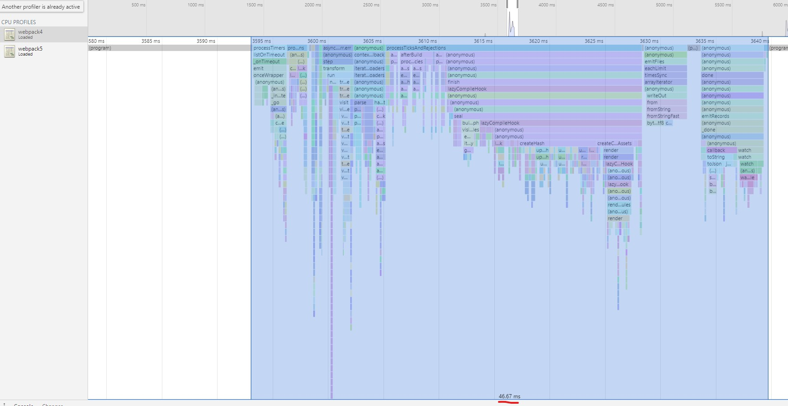
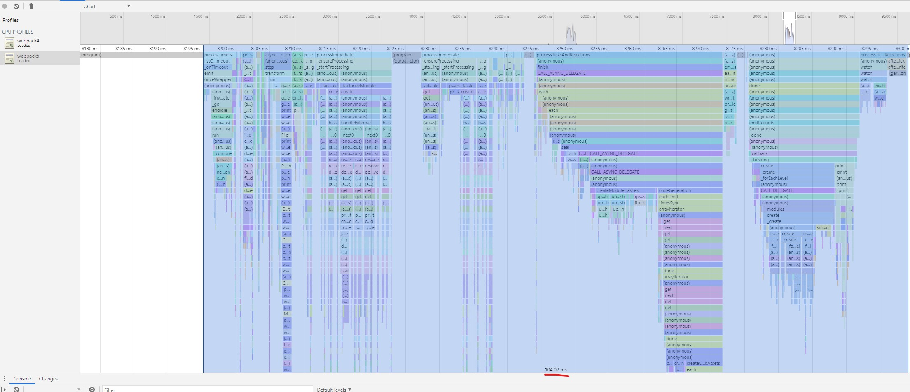

# Webpack 5 test repo

This repo shows performance degradation of rebuild for webpack5 comparing to webpack4

source code is based on https://github.com/Yog9/SnapShot to simulate some real world example

## How to reproduce

1. Clone this repo
2. Run `npm ci`
3. Run `cd webpack4 && npm ci && npm run start` webpack will start in watch mode with node's inspect flag to allow profiling
4. Make some changes to src to trigger bundle rebuild (for example change 'root' string inside ./src/index.js)

   This will show time to rebuild for webpack4:
   ```
    [webpack-cli] Compilation finished
    Hash: ba2b207d6c77ce2c4d86
    Version: webpack 4.44.2
    Time: 30ms
    Built at: 12/04/2020 8:38:32 AM
                            Asset      Size  Chunks                         Chunk Names
                            main.js  1.12 MiB    main  [emitted]              main
    styles.d938c1a8dd4406a5b9a5.css  3.53 KiB    main  [emitted] [immutable]  main
    Entrypoint main = styles.d938c1a8dd4406a5b9a5.css main.js
    [0] css ../node_modules/css-loader/dist/cjs.js??ref--5-1!../src/index.css 3.53 KiB {main}
    [../node_modules/react-dom/cjs/react-dom.development.js] 708 KiB {main}
    [../node_modules/react-dom/index.js] 1.32 KiB {main}
    [../node_modules/react-router-dom/esm/react-router-dom.js] 10.1 KiB {main}
    [../node_modules/react/cjs/react.development.js] 65.9 KiB {main}
    [../node_modules/react/index.js] 189 bytes {main}
    [../src/App.js] 6.2 KiB {main}
    [../src/components copy 2 sync recursive ^\.\/.*$] ../src/components copy 2 sync ^\.\/.*$ 493 bytes {main}
    [../src/components copy 2/Container.js] 761 bytes {main}
    [../src/components copy 3 sync recursive ^\.\/.*$] ../src/components copy 3 sync ^\.\/.*$ 493 bytes {main}
    [../src/components copy sync recursive ^\.\/.*$] ../src/components copy sync ^\.\/.*$ 493 bytes {main}
    [../src/components sync recursive ^\.\/.*$] ../src/components sync ^\.\/.*$ 493 bytes {main}
    [../src/index.css] 50 bytes {main}
    [../src/index.js] 735 bytes {main} [built]
    [../src/serviceWorker.js] 4.6 KiB {main}
        + 97 hidden modules
   ```

    

5. Close current running command at terminal and run `cd ../webpack5 && npm ci && npm run start`
6. Make some changes to src to trigger bundle rebuild (for example change 'root' string inside ./src/index.js)
    ```
    [webpack-cli] Compilation finished
    assets by status 3.53 KiB [cached] 1 asset
    asset main.js 1.16 MiB [emitted] (name: main)
    Entrypoint main 1.16 MiB = styles.679973daa17585e38272.css 3.53 KiB main.js 1.16 MiB
    cached modules 1020 KiB (javascript) 3.53 KiB (css/mini-extract) [cached] 109 modules
    runtime modules 1.19 KiB 5 modules
    ../src/index.js 735 bytes [built] [code generated]
    webpack 5.9.0 compiled successfully in 90 ms
    ```

    
7. Rebuild time for webpack5 shows more than 2 times slowness compare to webpack4